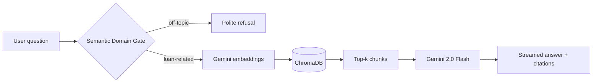

<div align="center">



[](https://git.io/typing-svg)

[](https://portfolio-lake-nu-74.vercel.app/)
[](https://www.linkedin.com/in/himanshu-chandlani-568b04285/)
[](mailto:himanshuchandlani07@gmail.com)


</div>


## 🛰️ Mission Briefing

```yaml
pilot:      Himanshu Chandlani
base:       Jaipur, India
academy:    B.Tech CSE @ JECRC Foundation (CGPA 8.45)
specialty:  [ML Engineering, RAG / GenAI, Full-Stack Python]
status:     Open to ML Engineer / Full-Stack Python roles
motto:      The best way to learn is to build
```

<div align="center">

| 🚀 Deployed Projects | 🎯 Model Accuracy | 🎓 Students Served | 💼 Internships | 📜 Certifications |
|:---:|:---:|:---:|:---:|:---:|
| **4** | **85%+** | **500+** | **2** | **5** |

</div>


## 🪐 Tech Orbit

<div align="center">

</div>


## 🌟 Flagship Mission: AI Loan Advisory Chatbot

> Capstone of my **Celebal Technologies** internship. A RAG system that answers loan questions from real documents, cites its sources, and refuses off-topic questions.



- 🛡️ Semantic Domain Gate blocks off-topic queries before they reach the LLM
- 📎 Answers cite source file and page number to reduce hallucination
- ⚡ Token-by-token streaming over Server-Sent Events
- 📄 PDF, DOCX, XLSX and web page ingestion with overlapping chunks
- 🔐 JWT auth, saved chat history, PDF export, and an EMI amortization calculator
- ☁️ Flask + Docker on Render, Vanilla JS frontend on Vercel

[](https://github.com/Himanshu0710-array/Himanshu_Chandlani_JECRC_Foundation_CEI)


## 🚀 More Missions

<table>
<tr>
<td width="50%" valign="top">

### 🔮 Customer Churn Prediction
**85%+ accuracy** on **7,000+ telecom records**. Logistic Regression behind a Flask API with a live prediction UI.


[Code](https://github.com/Himanshu0710-array/telco-churn-predictor) · [Live Demo](https://telco-churn-predictor-7117.onrender.com/)

</td>
<td width="50%" valign="top">

### 📄 Resume Screening System
Ranks **100+ resumes in under 10 seconds** using TF-IDF and cosine similarity against the job description.


[Code](https://github.com/Himanshu0710-array/Resume-Analyzer) · [Live Demo](https://resume-analyzer-chi-three.vercel.app/)

</td>
</tr>
<tr>
<td colspan="2" valign="top">

### 🎓 University Management System
Role-based portal (Admin / Faculty / Student) for **500+ students**: attendance, fees and test records.


[Code](https://github.com/Himanshu0710-array/eduportal) · [Live Demo](https://eduportal-b6om.onrender.com/)

</td>
</tr>
</table>


## 📡 Flight Log

| When | Where | What |
|:---|:---|:---|
| **May – Jul 2026** | **Celebal Technologies** (Data Science, CEI) | RAG pipeline with FAISS, agentic AI pipeline with tool calls, Loan Advisory Chatbot capstone |
| **Jun 2025** (45 days) | **Potential Tutorial** (Full Stack Intern) | Shipped full-stack features end to end |

## 🏅 Badges Earned

<div align="center">

| 🏅 | Achievement | Issuer | Year |
|:---:|:---|:---|:---:|
| 🟢 | Fundamentals of Deep Learning | **NVIDIA** | 2025 |
| 🔴 | Certified Data Science Professional (OCI) | **Oracle** | 2025 |
| 🔵 | Agentblazer Workshop (Trailhead) | **Salesforce** | 2025 |
| 🟩 | Data Analytics Job Simulation | **Deloitte · Forage** | 2025 |
| ⚡ | Innovation Hackathon, ICI FEST | **24-Hour Sprint** | 2025 |

</div>


## 📊 Telemetry

<div align="center">


<br/>


</div>


<div align="center">

**Currently leveling up:** Agentic AI · System Design · DSA · AI inside full-stack apps

*Building something with RAG, NLP or applied ML? Let's talk.*

</div>
