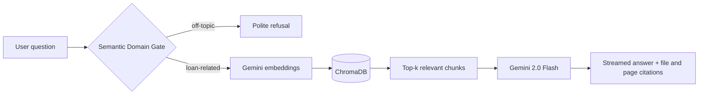

<div align="center">

</div>

<div align="center">

[](https://git.io/typing-svg)

[](https://portfolio-lake-nu-74.vercel.app/)
[](https://www.linkedin.com/in/himanshu-chandlani-568b04285/)
[](mailto:himanshuchandlani07@gmail.com)

**🟢 Open to ML Engineering and Full-Stack Python roles**

</div>

---

## ⚡ At a Glance

<div align="center">

| 🚀 Deployed Projects | 🎯 Model Accuracy | 🎓 Students Served | 💼 Internships | 📜 Certifications |
|:---:|:---:|:---:|:---:|:---:|
| **4** | **85%+** | **500+** | **2** | **5** |

</div>

---

## 🧬 About Me

```python
class HimanshuChandlani:

    def __init__(self):
        self.name      = "Himanshu Chandlani"
        self.location  = "Jaipur, India 🇮🇳"
        self.education = "B.Tech CSE @ JECRC Foundation (CGPA: 8.45)"
        self.focus     = ["ML Engineering", "RAG & GenAI Systems", "Full-Stack Python"]
        self.seeking   = "ML Engineer / Full-Stack Python Developer (post-graduation)"

    def tech_stack(self):
        return {
            "languages": ["Python", "C++", "JavaScript", "PHP"],
            "ml_ai":     ["scikit-learn", "NLTK", "TF-IDF", "Gemini API", "ChromaDB", "RAG"],
            "backend":   ["Flask", "SQLAlchemy", "JWT", "SSE streaming", "MySQL", "SQLite"],
            "deploy":    ["Docker", "Render", "Vercel", "Git", "Linux"],
        }

    def currently_learning(self):
        return ["Agentic AI", "System Design", "DSA", "AI + Full-Stack integration"]

    def motto(self):
        return "The best way to learn is to build 🔥"
```

---

## 🌟 Featured Project

### 🏦 AI Loan Advisory Chatbot — RAG System
> Capstone for my **Celebal Technologies** internship. Answers loan questions from real documents, cites its sources, and refuses to wander off-topic.



- 🛡️ **Semantic Domain Gate** blocks off-topic queries before they reach the LLM
- 📎 **Citation-based answers** with source file name and page number to reduce hallucination
- ⚡ **Token-by-token streaming** to the frontend using Server-Sent Events
- 📄 **Multi-format ingestion**: PDF, DOCX, XLSX and web pages, chunked with overlap
- 🔐 **JWT auth**, saved chat history, and PDF export of conversations
- 🧮 **EMI calculator** with a month-by-month amortization schedule
- ☁️ **Hybrid deployment**: Flask + Docker on Render, Vanilla JS frontend on Vercel


[](https://github.com/Himanshu0710-array/Himanshu_Chandlani_JECRC_Foundation_CEI)

---

## 🚀 More Projects

<table>
<tr>
<td width="50%" valign="top">

### 🔮 Customer Churn Prediction
> Telecom churn model with **85%+ accuracy** on **7,000+ records**

- 📊 Logistic Regression pipeline on real telecom data
- 🌐 Flask API with a live prediction UI
- ⚡ Sub-second inference in production


[](https://github.com/Himanshu0710-array/telco-churn-predictor)
[](https://telco-churn-predictor-7117.onrender.com/)

</td>
<td width="50%" valign="top">

### 📄 Resume Screening System
> NLP engine ranking **100+ resumes in under 10 seconds**

- 🧠 TF-IDF vectorization + cosine similarity
- 📁 Batch pipeline for bulk uploads
- 🎯 Relevance scoring against job descriptions


[](https://github.com/Himanshu0710-array/Resume-Analyzer)
[](https://resume-analyzer-chi-three.vercel.app/)

</td>
</tr>
<tr>
<td colspan="2" valign="top">

### 🎓 University Management System
> Role-based portal for **500+ students**: fees, attendance and test records in one place

- 🔐 Multi-role auth (Admin / Faculty / Student)
- 📋 Live attendance tracking and report generation
- 💳 Fee management with payment history


[](https://github.com/Himanshu0710-array/eduportal)
[](https://eduportal-b6om.onrender.com/)

</td>
</tr>
</table>

---

## 💼 Experience

| 🗓️ When | 🏢 Where | 🎯 What I did |
|:---|:---|:---|
| **May – Jul 2026** | **Celebal Technologies** · Data Science (CEI) | Weekly assignments building toward a RAG system: FAISS + sentence-transformers pipeline, an agentic AI pipeline with conditional routing and tool calls, then the Loan Advisory Chatbot capstone |
| **Jun 2025** (45 days) | **Potential Tutorial** · Full Stack Developer Intern | Built and shipped full-stack features end to end |

---

## 🛠️ Tech Arsenal

<div align="center">

**Languages**


**AI / ML**


**Backend, Data and DevOps**


</div>

---

## 🏆 Certifications and Achievements

<div align="center">

| 🏅 | Achievement | Issuer | Year |
|:---:|:---|:---|:---:|
| 🟢 | Fundamentals of Deep Learning | **NVIDIA** | 2025 |
| 🔴 | Certified Data Science Professional (OCI) | **Oracle** | 2025 |
| 🔵 | Agentblazer Workshop (Trailhead) | **Salesforce** | 2025 |
| 🟩 | Data Analytics Job Simulation | **Deloitte · Forage** | 2025 |
| ⚡ | Innovation Hackathon, ICI FEST | **24-Hour Sprint** | 2025 |

</div>

---

## 📊 GitHub Stats

<div align="center">


&nbsp;&nbsp;


<br/><br/>


<br/><br/>


</div>

---

## 🌱 Currently Leveling Up

```text
┌──────────────────────────────────────────────────┐
│  🤖  Agentic AI · tool use · conditional routing │
│  📐  Data Structures & Algorithms                │
│  🏗️   System Design Fundamentals                 │
│  🔗  Shipping AI features inside full-stack apps │
└──────────────────────────────────────────────────┘
```

---

## 🤝 Let's Connect

<div align="center">

I'm looking for ML Engineering and Full-Stack Python roles. If you're building something with RAG, NLP or applied ML, I'd love to talk.

[](https://www.linkedin.com/in/himanshu-chandlani-568b04285/)
[](https://portfolio-lake-nu-74.vercel.app/)
[](https://github.com/Himanshu0710-array)
[](mailto:himanshuchandlani07@gmail.com)

<br/>


<br/>


</div>
